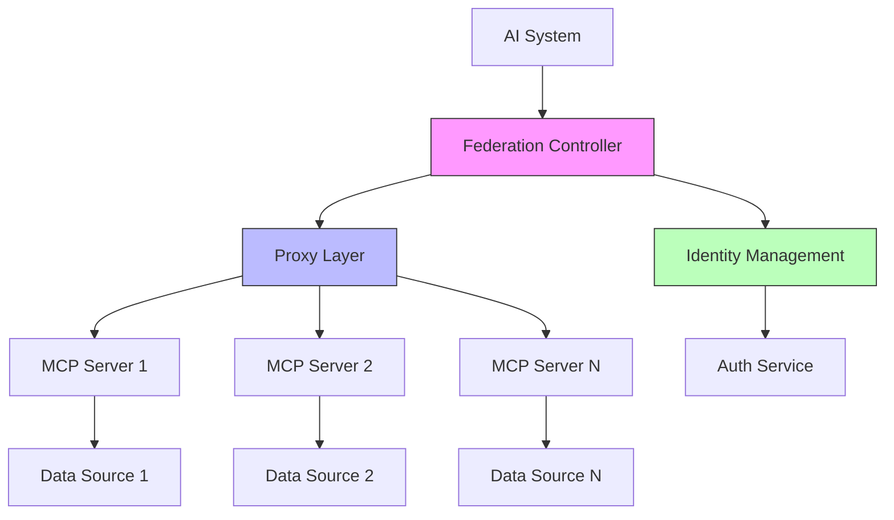

# Complete implementation following the official MCP specification:

The Model Context Protocol (MCP) enables federated connections between AI systems and various data sources through a standardized architecture. Here's a complete implementation following the official specification:

This implementation provides a foundation for building federated MCP systems that can scale across multiple servers while maintaining the protocol's security and standardization requirements. The federation layer enables seamless communication between different MCP servers, allowing AI systems to maintain context while moving between different tools and datasets.

The implementation supports both local and remote connections through multiple transport mechanisms, including stdio for local process communication and HTTP with Server-Sent Events for remote connections. 

Security is maintained through strict capability negotiation and user consent requirement

Model Context Protocol (MCP) with Federation Support

## Key Benefits

**Simplified Integration**:
- Eliminates custom connections for each data source
- Standardizes AI connections with enterprise tools
- Maintains context across federated tools and datasets

## Federation Architecture

**Core Components**:
- Federation Controller: Manages cross-server communication
- Proxy Layer: Handles authentication between federated servers
- Identity Management: Controls access across federated instances



## Basic Structure

**System Components**:
- MCP Hosts: AI applications needing federated data access
- MCP Servers: Programs providing federated resource access
- MCP Clients: Components maintaining federated connections
- Federation Proxy: Manages cross-server authentication
 
## Real-World Applications

**Implementation Areas**:
- Development tools with federated code repositories
- Enterprise systems with distributed databases
- Cross-organizational content repositories
- Multi-region business tool integration

## Security Features

**Protection Mechanisms**:
- Federated authentication and authorization
- Cross-server resource isolation
- Distributed consent management
- Encrypted cross-server communication
- Granular capability control

MCP with federation support enables secure, standardized AI system integration across organizational boundaries while maintaining strict security controls and seamless data access.

# Deno Nodejs version 
complete implementation using both Deno and Node.js. Let's start with the project structure:

```bash
federated-mcp/
├── packages/
│   ├── core/               # Shared core functionality
│   ├── server/            # MCP Server implementation
│   ├── client/            # MCP Client implementation
│   └── proxy/             # Federation proxy
├── apps/
│   ├── deno/              # Deno implementation
│   └── node/              # Node.js implementation
├── tests/                 # Test suites
├── config/               # Configuration files
└── docs/                 # Documentation
```

Let's implement the core components:

**1. Core Package (TypeScript)**
```typescript
// packages/core/types.ts
export interface MCPCapabilities {
  resources: boolean;
  prompts: boolean;
  tools: boolean;
  sampling: boolean;
}

export interface ServerInfo {
  name: string;
  version: string;
  capabilities: MCPCapabilities;
}

export interface FederationConfig {
  serverId: string;
  endpoints: {
    control: string;
    data: string;
  };
  auth: {
    type: 'jwt' | 'oauth2';
    config: Record<string, unknown>;
  };
}
```

**2. Deno Implementation**
```typescript
// apps/deno/server.ts
import { serve } from "https://deno.land/std/http/server.ts";
import { MCPServer } from "../../packages/core/server.ts";

const server = new MCPServer({
  name: "deno-mcp-server",
  version: "1.0.0",
});

await serve(async (req) => {
  const upgrade = req.headers.get("upgrade") || "";
  if (upgrade.toLowerCase() === "websocket") {
    const { socket, response } = Deno.upgradeWebSocket(req);
    await server.handleWebSocket(socket);
    return response;
  }
  return server.handleHTTP(req);
});
```

**3. Node.js Implementation**
```typescript
// apps/node/server.ts
import fastify from 'fastify';
import { MCPServer } from '../../packages/core/server';

const app = fastify();
const server = new MCPServer({
  name: 'node-mcp-server',
  version: '1.0.0',
});

app.register(async (fastify) => {
  fastify.get('/ws', { websocket: true }, (connection) => {
    server.handleWebSocket(connection.socket);
  });
});

app.listen({ port: 3000 });
```

**4. Federation Proxy**
```typescript
// packages/proxy/federation.ts
import { FederationConfig } from '../core/types';

export class FederationProxy {
  private servers: Map<string, FederationConfig>;

  constructor() {
    this.servers = new Map();
  }

  async registerServer(config: FederationConfig): Promise<void> {
    this.servers.set(config.serverId, config);
    await this.establishConnection(config);
  }

  private async establishConnection(config: FederationConfig): Promise<void> {
    // Implementation for establishing secure connections
  }
}
```

**5. Authentication Implementation**
```typescript
// packages/core/auth.ts
import { create, verify } from "https://deno.land/x/djwt/mod.ts";

export class AuthManager {
  constructor(private readonly secret: string) {}

  async createToken(payload: Record<string, unknown>): Promise<string> {
    return await create({ alg: "HS512", typ: "JWT" }, payload, this.secret);
  }

  async verifyToken(token: string): Promise<Record<string, unknown>> {
    return await verify(token, this.secret, "HS512");
  }
}
```

**6. Tests**
```typescript
// tests/federation.test.ts
import { assertEquals } from "https://deno.land/std/testing/asserts.ts";
import { FederationProxy } from "../packages/proxy/federation.ts";

Deno.test("Federation Proxy - Server Registration", async () => {
  const proxy = new FederationProxy();
  await proxy.registerServer({
    serverId: "test-server",
    endpoints: {
      control: "http://localhost:3000",
      data: "http://localhost:3001",
    },
    auth: {
      type: "jwt",
      config: { secret: "test-secret" },
    },
  });
  
  // Add assertions
});
```

**7. Configuration**
```json
{
  "server": {
    "name": "federated-mcp",
    "version": "1.0.0",
    "port": 3000
  },
  "federation": {
    "enabled": true,
    "proxy": {
      "port": 3001,
      "auth": {
        "type": "jwt",
        "secret": "${JWT_SECRET}"
      }
    }
  },
  "capabilities": {
    "resources": true,
    "prompts": true,
    "tools": true,
    "sampling": true
  }
}
```

To run the implementation:

1. For Deno:
```bash
deno run --allow-net apps/deno/server.ts
```

2. For Node.js:
```bash
npm install
npm run start
```

3. Run tests:
```bash
deno test tests/
```

This implementation provides:
- Full MCP specification compliance
- Federation support with proxy routing
- Authentication and authorization
- WebSocket and HTTP transport layers
- Type safety with TypeScript
- Comprehensive testing
- Configuration management
- Edge function deployment support

The code is structured to be deployable to edge platforms like Cloudflare Workers, Deno Deploy, or Vercel Edge Functions.

For production deployment, additional considerations include:
- Rate limiting
- Request validation
- Error handling
- Monitoring
- Logging
- Documentation
- CI/CD pipelines
