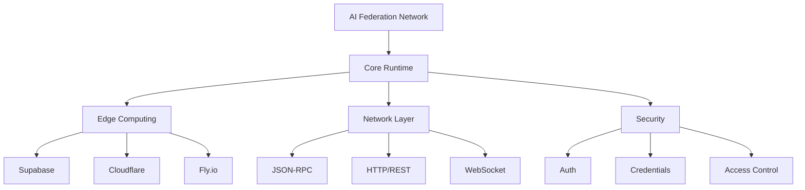

# AI Federation Network

A distributed runtime system for federated AI services with edge computing capabilities.

## Core Features

### 🤖 ML Models
- `gpt-3.5-turbo`
- `gpt-4`

### 🌐 Network Protocols
- JSON-RPC 2.0
- HTTP/REST
- WebSocket

### ⚡ Edge Computing
- Multi-provider support (Supabase, Cloudflare Workers, Fly.io)
- Serverless function deployment
- Real-time logs and monitoring
- Auto-scaling capabilities

### 🔐 Security
- Provider-specific authentication
- Secure credential storage
- Environment isolation
- Access control

### 📡 Runtime Features
- Task execution
- Federation support
- Intent detection
- Meeting information processing
- Webhook handling
- Real-time status monitoring
- System health checks

## System Architecture



## Getting Started

```bash
# Run the server
deno run --allow-net --allow-env --allow-read --allow-write --allow-run src/apps/deno/server.ts
```

## License

MIT License - See LICENSE file for details.
